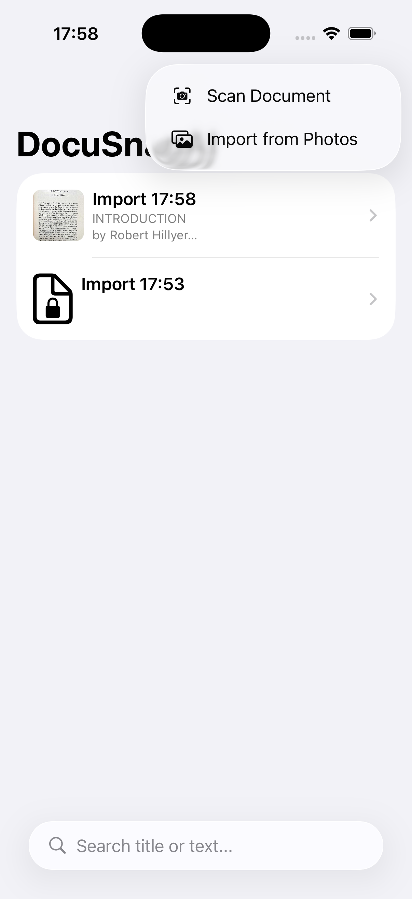
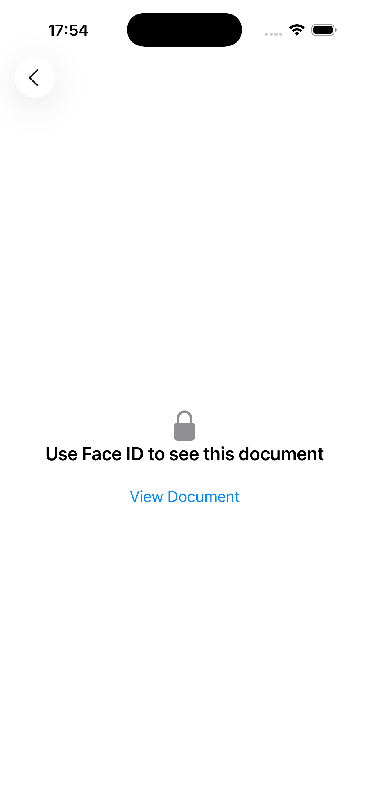
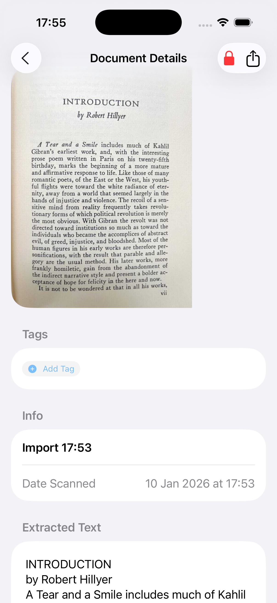

# DocuSnap AI: Intelligent Offline Document Manager

**DocuSnap AI** is a native iOS application that leverages on-device Machine Learning to scan, digitize, and organize physical documents. Built with a strict "Offline-First" philosophy, it performs OCR (Optical Character Recognition) locally using the Vision Framework, ensuring sensitive user data never leaves the device.

  
  
  
  

##  Key Features

* **On-Device OCR:** Utilizes Apple's `Vision` framework to extract text from documents instantly without network latency or cloud dependencies.
* **Smart Organization:** Implements a relational tagging system (`Many-to-Many`) allowing users to categorize documents dynamically (e.g., #Receipts, #Work).
* **Biometric Security:** Integrated `LocalAuthentication` to lock sensitive documents behind FaceID/TouchID.
* **Batch Processing:** Supports importing multiple images from the Photo Library simultaneously, processing OCR and PDF generation in parallel.
* **Siri Integration:** Custom App Intents allow users to launch the scanner via Siri ("Siri, Scan Document") or Shortcuts widgets.
* **PDF Generation:** Automatically creates shareable PDF assets from scanned images for easy export.

## 🛠Tech Stack

* **Language:** Swift 5.9+
* **UI Framework:** SwiftUI
* **Persistence:** SwiftData (Schema Relationships & Migration)
* **Computer Vision:** VisionKit & Vision Framework
* **Concurrency:** Swift Concurrency (`async/await`, `TaskGroup`, `Task.detached`)
* **System Integration:** AppIntents (Siri), PhotosUI, LocalAuthentication
* **Architecture:** MVVM (Model-View-ViewModel)

##  Engineering Highlights

### 1. High-Performance Image Caching
A common pitfall in document apps is UI "hangs" caused by decoding high-resolution images on the main thread.
* **Problem:** Scrolling the document list was dropping frames because `UIImage(data:)` is a synchronous, heavy operation.
* **Solution:** I implemented a custom `ImagePersistenceService` that leverages **detached Tasks** to decode images on background threads. The UI utilizes a placeholder state while the heavy lifting happens off the main actor, resulting in buttery smooth scrolling even with hundreds of documents.

### 2. Parallel Batch Processing
When importing multiple documents from the Photo Library, processing them sequentially was too slow.
* **Solution:** I utilized Swift's **`TaskGroup`** to create a parallel processing pipeline. This allows the app to perform File I/O, OCR, and PDF generation for multiple images simultaneously, significantly reducing wait times for the user.

### 3. Reactive Data Flow with SwiftData
Instead of manually managing state arrays, the app relies on the database as the "Single Source of Truth."
* **Implementation:** Using `@Query` with dynamic `#Predicate` construction allows the list to instantly reflect search terms and tag filters without manual reloading. I implemented a complex `Tag` management system using SwiftData's `@Relationship` macro to ensure data integrity when deleting or renaming tags.

---
*Created by [Leonardo Solis] - 2025*
